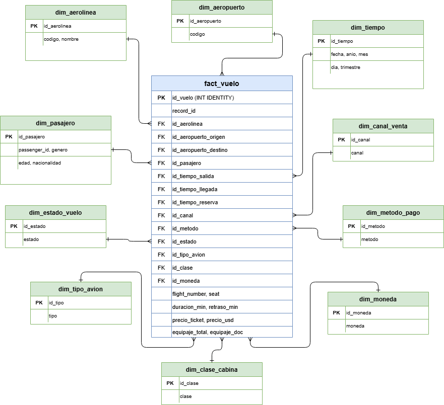

# Practica 1 - Proceso ETL
## Seminario de Sistemas 2
**Carnet:** 202200041

---

## Descripcion General

Esta practica consiste en un proceso ETL (Extraccion, Transformacion y Carga) desarrollado en Python. Se trabajan dos datasets con informacion de vuelos y pasajeros, se limpian y estandarizan los datos, y se cargan en un modelo multidimensional en SQL Server.

---

## Tecnologias Utilizadas

- Python 3.12
- pandas, numpy, pyodbc
- Microsoft SQL Server
- Docker / Docker Compose


---

## Proceso ETL

### Fase 1: Extraccion

Se leen los dos archivos CSV proporcionados:
- **Dataset1.csv** (separador `,`): contiene datos de vuelos como aerolinea, aeropuertos, fechas, duracion, estado del vuelo, tipo de avion, clase de cabina y asiento.
- **Dataset2.csv** (separador `;`): contiene datos de pasajeros como genero, edad, nacionalidad, fecha de reserva, canal de venta, metodo de pago, precio del ticket, moneda y equipaje.

Ambos datasets tienen 10,000 registros cada uno.

### Fase 2: Transformacion

Durante el analisis de los datos se encontraron las siguientes inconsistencias que se corrigen en esta fase:

| Columna | Problema | Solucion |
|---|---|---|
| `airline_name` | Mayusculas y minusculas mezcladas (ej. "Iberia" vs "IBERIA") | Se normaliza todo a mayusculas |
| `origin_airport` | Codigos en minusculas (ej. "jfk" vs "JFK") | Se normaliza a mayusculas |
| `destination_airport` | Mismo problema que origin | Se normaliza a mayusculas |
| `departure_datetime` | Dos formatos: `DD/MM/YYYY HH:MM` y `MM-DD-YYYY HH:MM AM/PM` | Se parsean ambos formatos a datetime |
| `arrival_datetime` | Mismos formatos + 560 nulos (vuelos cancelados) | Se parsea; nulos se dejan como NULL |
| `duration_min`, `delay_min`, `seat` | 560 nulos por vuelos cancelados | Se dejan como NULL |
| `passenger_gender` | 12 variantes: M, m, Masculino, F, f, Femenino, X, x, NoBinario, etc. | Se mapea a 3 valores: M, F, X |
| `passenger_age` | 112 valores nulos | Se dejan como NULL |
| `passenger_nationality` | 209 valores nulos | Se dejan como NULL |
| `booking_datetime` | Dos formatos de fecha (igual que departure) | Se parsean ambos formatos |
| `sales_channel` | 144 valores nulos | Se dejan como NULL |
| `ticket_price` | Algunas usan coma como decimal (ej. "77,60") | Se reemplaza `,` por `.` y se convierte a float |

Despues de las transformaciones se unen ambos dataframes por posicion (eje horizontal) ya que cada fila del Dataset1 corresponde a la misma fila del Dataset2.

### Fase 3: Carga

Los datos transformados se cargan en SQL Server usando `pyodbc`. Primero se insertan los valores unicos en las tablas de dimension y luego se carga la tabla de hechos con las llaves foraneas correspondientes.

---

## Modelo Multidimensional

Se implemento un esquema estrella con 10 tablas de dimension y 1 tabla de hechos.

### Diagrama del Modelo



### Tablas de Dimension

| Tabla | Descripcion | Campos |
|---|---|---|
| `dim_aerolinea` | Codigos y nombres de aerolineas | codigo, nombre |
| `dim_aeropuerto` | Codigos de aeropuerto (IATA) | codigo |
| `dim_pasajero` | Datos del pasajero | passenger_id, genero, edad, nacionalidad |
| `dim_tiempo` | Fechas desglosadas | fecha, anio, mes, dia, trimestre |
| `dim_canal_venta` | Canal donde se compro el ticket | canal (APP, WEB, AGENCIA, etc.) |
| `dim_metodo_pago` | Forma de pago | metodo (TARJETA, PAYPAL, EFECTIVO, etc.) |
| `dim_estado_vuelo` | Estado del vuelo | estado (ON_TIME, DELAYED, CANCELLED, DIVERTED) |
| `dim_tipo_avion` | Modelo de aeronave | tipo (B737, A320, etc.) |
| `dim_clase_cabina` | Clase del asiento | clase (ECONOMY, BUSINESS, FIRST, PREMIUM_ECONOMY) |
| `dim_moneda` | Moneda del ticket | moneda (USD, GTQ, MXN, EUR) |

### Tabla de Hechos

`fact_vuelo` contiene las llaves foraneas a todas las dimensiones y las medidas numericas:
- `duracion_min` - duracion del vuelo en minutos
- `retraso_min` - minutos de retraso
- `precio_ticket` - precio en moneda original
- `precio_usd` - precio estimado en dolares
- `equipaje_total` - total de maletas
- `equipaje_documentado` - maletas documentadas

---

## Consultas Analiticas

Se incluyen 15 consultas en el archivo `consultas.sql`:

1. Total de vuelos por aerolinea
2. Top 5 destinos mas frecuentes
3. Distribucion de pasajeros por genero
4. Vuelos por estado (ON_TIME, DELAYED, etc.)
5. Promedio de retraso por aerolinea
6. Ingresos totales por moneda
7. Metodo de pago mas utilizado
8. Top 5 rutas mas frecuentes (origen-destino)
9. Cantidad de vuelos por mes y anio
10. Canal de venta mas utilizado
11. Promedio de precio USD por clase de cabina
12. Distribucion de pasajeros por nacionalidad
13. Promedio de equipaje por canal de venta
14. Vuelos cancelados por aerolinea
15. Tipo de avion mas utilizado

---

## Resultados Obtenidos

Al ejecutar el proceso ETL se obtuvieron los siguientes resultados:

### Extraccion
- Dataset1.csv: 10,000 registros, 14 columnas (datos de vuelos)
- Dataset2.csv: 10,000 registros, 12 columnas (datos de pasajeros)

### Transformacion
- `airline_name`: normalizado a mayusculas (10 aerolineas unicas)
- `origin_airport` y `destination_airport`: normalizados a mayusculas
- `departure_datetime` y `arrival_datetime`: parseados exitosamente desde 2 formatos distintos
- `passenger_gender`: 12 variantes reducidas a 3 valores (M, F, X)
- `ticket_price`: separador decimal corregido de coma a punto
- Nulos conservados: 560 en arrival/duration/delay/seat (cancelados), 112 en edad, 209 en nacionalidad, 144 en canal de venta

### Carga
- 10,000 registros insertados en `fact_vuelo`
- 10 tablas de dimension pobladas correctamente
- Dataframe unido: 10,000 registros, 26 columnas

---

## Pasos para Ejecutar

### 1. Levantar SQL Server con Docker

```bash
cd Practica_1
docker compose up -d
```

Esperar unos 15 segundos a que el contenedor inicie.

### 2. Crear la base de datos

```bash
docker exec -it sql_practica1 /opt/mssql-tools18/bin/sqlcmd \
  -S localhost -U sa -P 'Pr4ctica1#SS2' -C \
  -Q "CREATE DATABASE practica1_ss2"
```

### 3. Instalar dependencias de Python

```bash
pip install pandas pyodbc numpy
```

Tambien se necesita el ODBC Driver 18 para SQL Server instalado en el sistema.

### 4. Ejecutar el ETL

```bash
python3 Main.py
```

Esto ejecuta las 3 fases: extraccion, transformacion y carga.

### 5. Ejecutar consultas analiticas

Se pueden correr desde cualquier cliente SQL (Azure Data Studio, DBeaver, datagrip) conectandose a `localhost:1433` con usuario `sa` y password `Pr4ctica1#SS2`, o desde terminal:


---

## Datos de Conexion

| Campo | Valor |
|---|---|
| Server | localhost, 1433 |
| Database | practica1_ss2 |
| User | sa |
| Password | Pr4ctica1#SS2 |