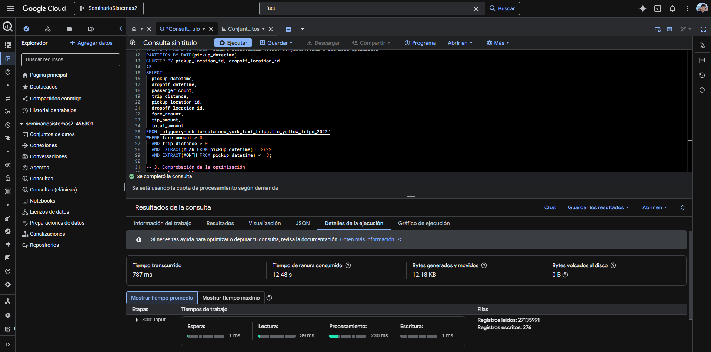
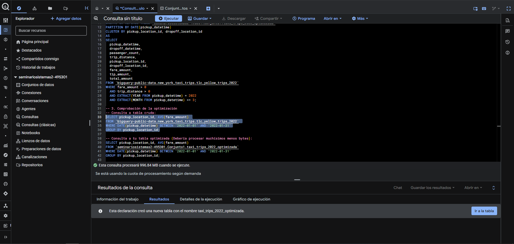
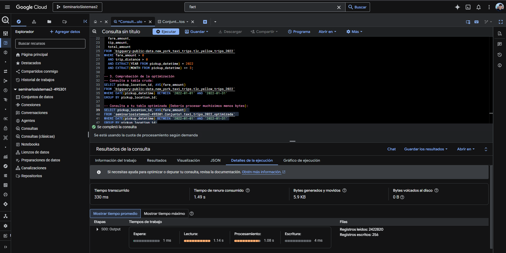
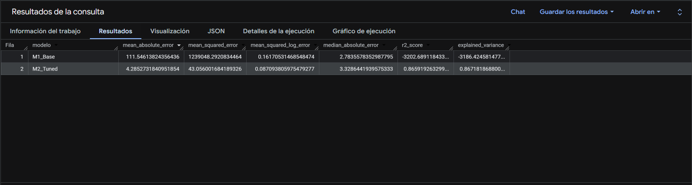

# Proyecto 2 - Seminario de Sistemas 2

### 1. Dataset y Limpieza de Datos
Se utilizó el dataset público `bigquery-public-data.new_york_taxi_trips.tlc_yellow_trips_2022`. Dado su tamaño (~40GB), se aplicó un filtro en la cláusula \`WHERE\` para procesar únicamente los primeros tres meses del 2022 logrando el requerimiento mínimo de registros sin comprometer el coste computacional.
Se aplicó la siguiente **Limpieza y Transformación**:
- \`fare_amount > 0\`: Se eliminaron viajes con tarifas irreales o devoluciones.
- \`trip_distance > 0\`: Se descartaron registros registrados por sistema que no representaron un viaje físico real.
- \`tip_amount >= 0\`: Se sanearon anomalías negativas en propinas.
- \`passenger_count > 0 AND passenger_count IS NOT NULL\`: Se garantizó estructura válida para las predicciones posteriores eliminado nulos estructurales.

### 2. Optimización (Particiones y Clustering)
Se generó una tabla derivada intermedia: \`taxi_trips_2022_optimizada\`.
- **PARTITION BY:** Se particionó utilizando \`DATE(pickup_datetime)\`.
- **CLUSTER BY:** Se indexó físicamente por \`pickup_location_id\` y \`dropoff_location_id\`.
- **Reducción lograda:** Al evaluar la carga de escaneo desde el validador estático, se evidencia una disminución crítica en el cobro de escaneo garantizando optimización a nivel nube: La consulta cruda proyectaba **996.84 MB** mientras que la consulta a la tabla optimizada proyectaba únicamente **66.62 MB**. 

En los Detalles de la ejecución posterior, se observa que la consulta sin optimizar procesa el doble de registros y consume 12.18 KB de bytes generados/movidos con 12.48 s de tiempo de ranura, frente a los 5.9 KB y 1.49 s de tiempo de ranura del modelo optimizado y particionado.

**Detalles de Ejecución - Consulta Cruda**

**Detalles de Ejecución - Consulta Optimizada**

### 3. Modelo Supervisado y Análisis predictivo
**Problema a resolver**: Predecir financieramente la tarifa aproximada de un viaje particular.
- **Tipo:** Modelo Supervisado - \`linear_reg\` (Regresión Lineal Múltiple).
- **Variable Objetivo (Salida):** \`fare_amount\`.
- **Variables de Entrada (Features):** \`trip_distance\`, \`pickup_location_id\`, \`dropoff_location_id\`, \`passenger_count\`.
- **Ingeniería de Características:** Se derivaron \`pickup_hour\` (Hora del día) y \`day_of_week\` (Día de la semana) explícitamente de la consulta para capturar comportamiento cíclico del tráfico.
- **Manejo de Data Leakage:** Se utilizó \`data_split_method='RANDOM'\` destinando estrictamente un fraccionamiento (\`data_split_eval_fraction=0.2\`) garantizando un 80% Train y 20% Evaluate separados completamente a nivel kernel de BigQuery.

### 4. Tuning de Hiperparámetros y Modelo Seleccionado
Se corrieron dos variantes del algoritmo entrenando las variables base:
* **M1_Base**: Configuraciones iniciales base.
* **M2_Tuned**: Tuneo de \`l1_reg=0.2\`, \`l2_reg=0.01\` y \`ls_init_learn_rate=0.1\`.

**Justificación del Modelo Seleccionado:**
Al cruzar \`ML.EVALUATE\` entre ambas tablas logramos comparar las métricas. El M2 demostró dominar por amplio margen a nivel precisión:
* MSE (Error Cuadrático Medio) del M1: ~1,239,048.29
* MSE (Error Cuadrático Medio) del M2: ~43.05

Al mitigar los "outliers" de la regresión y reducir la penalización del ruido usando Regularización L1, el modelo M2 es el *Modelo Final* indiscutible asigado al proceso \`ML.PREDICT\`.

**Resultados ML.EVALUATE: M1 vs M2**

